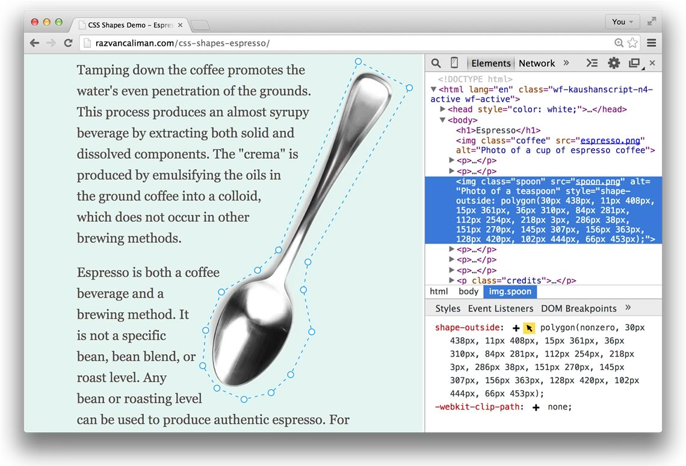

## CSS Shapes Editor for Chrome DevTools

Chrome DevTools extension for live on-screen editing of CSS Shapes property values.

### Demo

https://www.youtube.com/watch?v=ZxD44LTKTuQ

### How to install

__Simple__
 1. Open Google Chrome (min version 37, check `chrome://version/`)
 2. [Install extension from Chrome Web Store](https://chrome.google.com/webstore/detail/css-shapes-editor/nenndldnbcncjmeacmnondmkkfedmgmp)

__From source__
 1. Clone this repository.
 2. Open Google Chrome (min version 37, check `chrome://version/` or [download Canary](https://www.google.co.uk/intl/en/chrome/browser/canary.html))
   - Navigate to `chrome://extensions`
   - Toggle on "Developer mode" checkbox
   - Click "Load unpacked extension"
   - Select the cloned repository folder

### How to use

- Launch DevTools (_View > Develop > Developer Tools_)
- Switch to _Elements_ panel
- Look for the new _Shapes_ sidebar next to _Styles_, _Event Listeners_, etc.
- In the _Shapes_ sidebar:
  - click "create" and select a shape type to add
    - an interactive editor appears on top of the selected element
  - click "edit" to turn on editor and adjust an existing shape
  - click "edit" again to remove the editor
  - **tip**: hold the _Shift_ key and click "edit" to convert the shape coordinate units

### Sample content

Use with the [CSS Shapes Espresso demo](https://oslego.github.io/css-shapes-espresso) ([source](https://github.com/oslego/css-shapes-espresso)), or learn [how to create](http://alistapart.com/article/css-shapes-101) your own sample.

### Known limitations

- Manually editing code in the _Shapes_ sidebar, like in _Styles_, is not yet available.
- There is no interactive editor for `inset()` shape function. Only `polygon()`, `circle()` and `ellipse()` are supported.

### Credits

- [CSS Shapes Editor library](https://github.com/adobe-webplatform/css-shapes-editor)
- [Underscore](https://github.com/jashkenas/underscore)
- helpers & insight from [TodoMVC](https://github.com/tastejs/todomvc)
- Icons:
  - [Cursor](http://thenounproject.com/term/cursor/39925/) by Danny Sturgess from The Noun Project
  - [Plus](http://thenounproject.com/term/plus/2876/) by P.J. Onori from The Noun Project
